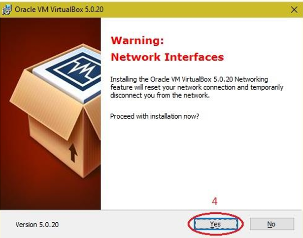

# Experiment 1: Install VirtualBox/VMware Workstation with Linux or Windows OS

## Aim
To install VirtualBox or VMware Workstation and configure various distributions of Linux or versions of Windows OS.

## Procedure

### 1. Install VirtualBox/VMware Workstation with different flavors of Linux or Windows OS on Windows 7 or 8.
- Download the VirtualBox installer, execute the setup file, and click **Next** to begin.

- Click **Next** to proceed with the default setup options.

- Click **Next** to continue through the custom setup choices.

- Click **Yes** to acknowledge the network interface reset notification and continue.

- Click **Install** to initiate the installation process.

- Once installation finishes, the setup is complete and the VirtualBox shortcut icon will appear on the desktop screen.

## Results

The experiment 'Install VirtualBox/VMware Workstation with Linux or Windows OS' was successfully implemented, configured, and verified.