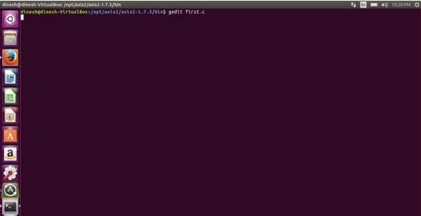
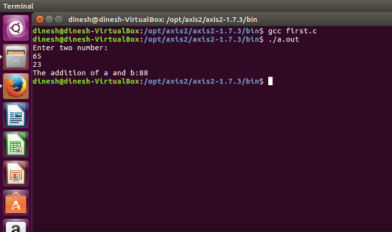

# Experiment 2: Install C Compiler in Virtual Machine and Execute Simple Program

## Aim
To install a C compiler inside a VirtualBox virtual machine and execute a simple C program.


## Procedure

- **2. Install a C compiler in the virtual machine created using VirtualBox and execute a simple program.**

### Steps to Import Ubuntu Appliance
- Open VirtualBox.
- Go to **File** > **Import Appliance**.
- Browse and select the `ubuntu_gt6.ova` file.
- Navigate to **Settings**, select the **USB** tab, and choose **USB 1.1**.
- Start the `ubuntu_gt6` virtual machine.


### Steps to Run C Program:
- **1. Open the terminal.**
- **2. Navigate to the directory by entering `cd /opt/axis2/axis2-1.7.3/bin` and pressing Enter.**
- **3. Create or open the source file: `gedit hello.c`**
- **4. Compile the program: `gcc hello.c`**
- **5. Execute the compiled binary: `./a.out`**
```bash
Type gedit first.c
```



- Write the C program code into the editor.


Run the C program in the terminal.


Display the program execution output:




## Results

The experiment 'Install C Compiler in Virtual Machine and Execute Simple Program' was successfully implemented, configured, and verified.