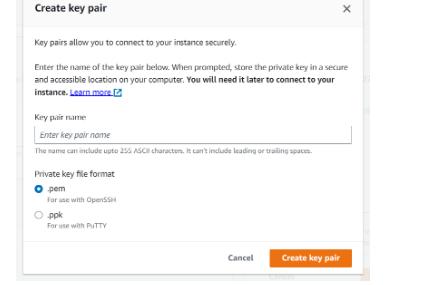

# Experiment 3: Create EC2 Instance in AWS (Amazon)

## Aim
Create EC2 Instance in AWS (Amazon)

## Procedure

3. Create EC2 Instance in AWS (Amazon)
The following are the steps for creating and connecting to an EC2 instance in AWS (Amazon):

### Step 1: Log in to your AWS account. Click on **Services** on the left of the AWS Management Console primary screen, and select **EC2** from the options menu. (To set up an AWS free tier account, refer to Amazon Web Services (AWS) – Free Tier Account Set up).

### Step 2: Click on **Launch Instance**. You will be redirected to the launch configuration page to set up the new instance. Configure all required parameters, including specifying the instance name as shown below.

### Step 3: Select an AMI (Amazon Machine Image) for your desired operating system from the available options based on your requirements.

### Step 4: By default, the system selects free-tier eligible configurations (if eligible). Choose an instance type suited to your CPU and memory needs. The default `t2.micro` is Free Tier eligible; avoid selecting paid types to prevent unexpected charges. (To learn more, refer to Amazon EC2 – Instance Types).

### Step 5: Keep the default network settings unless specific changes are required. Under storage, Free Tier eligible accounts receive up to 30 GB of EBS Storage; keep the default settings.

### Step 6: Verify that all selected options qualify for the Free Tier, then click **Launch Instance** to provision the virtual machine.

### Steps to Connect via Terminal Using SSH Key:

### Step 1: Select the running instance you wish to access and click the **Connect** button at the top of the instance dashboard.

### Step 2: Copy the provided SSH command example, which uses your downloaded key-pair (`.pem` file) to authenticate with the EC2 instance.

### Step 3: Open your terminal, navigate to the folder where your `.pem` key file is saved, paste the copied SSH command, and run it to connect to the instance.

## Results

The experiment for 'Create EC2 Instance in AWS (Amazon)' was successfully implemented, configured, and verified.