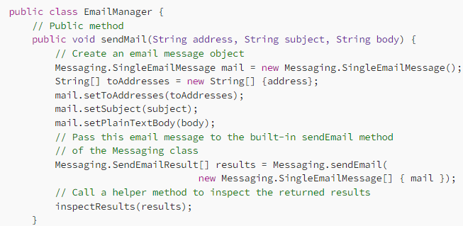
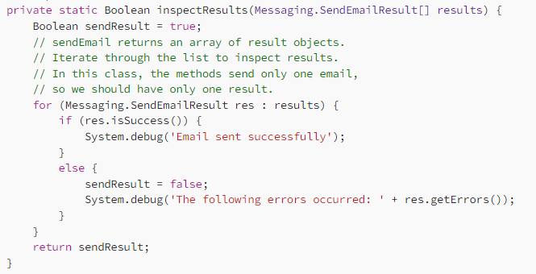
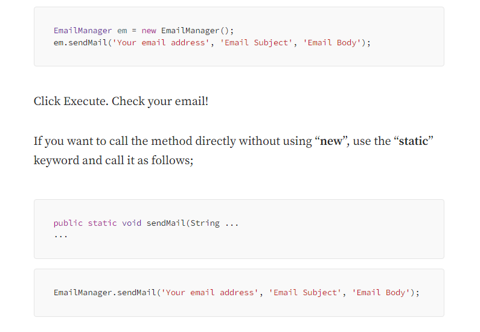

# Experiment 5: Implement Mailing Service using Apex Programming Language on Salesforce

## Aim
Implement a mailing service using the Apex programming language on salesforce.com

## Procedure

5. Implement a mailing service using the Apex programming language on salesforce.com

### Step 1: Open the Developer Console
To open the Developer Console, click your profile name or the setup gear icon in the upper-right corner of the Salesforce interface.

### Step 2: Create a New Apex Class
In the Developer Console, click **File** > **New** > **Apex Class**. Enter `EmailManager` as the class name and click **OK**.

### Step 3: Replace the Default Class Body
Replace the default class body with the `EmailManager` implementation shown below:

### Step 4: Save the Class
Click **File** > **Save** to save and compile your class. Once saved, this class can be used to send emails from other Apex classes, triggers, or anonymous code blocks.

### Step 6: Test the Output
In the Developer Console, select **Debug** > **Open Execute Anonymous Window**.
In the execution window, enter the code snippet and replace `'Your email address'` with your actual email address.

## Results

The experiment for 'Implement Mailing Service using Apex Programming Language on Salesforce' was successfully implemented, configured, and verified.