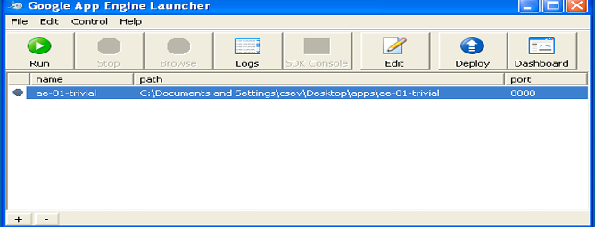
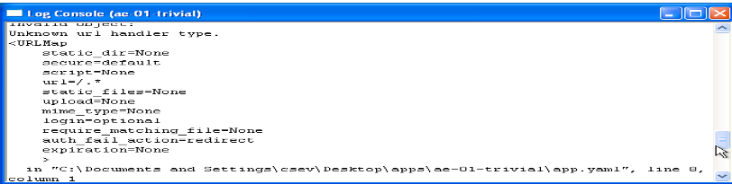

# Experiment 9: Use Google App Engine Launcher to Launch Web Applications

## Aim
To use Google App Engine Launcher to launch web applications.


## Procedure

9. Use Google App Engine Launcher to launch web applications.

Navigate to your workspace directory (such as `C:\Documents and Settings\csev\Desktop\apps`) and create a subfolder within `apps` named `ae-01-trivial` (e.g., path: `C:\Documents and Settings\csev\Desktop\apps\ae-01-trivial`). Using a text editor (such as JEdit at www.jedit.org), create the application configuration and script files:

### Application Configuration (`app.yaml`)
```yaml
application: ae-01-trivial
version: 1
runtime: python
api_version: 1

handlers:
  - url: /.*
    script: index.py
```

### Python Script (`index.py`)
```python
print 'Content-Type: text/plain'
print ''
print 'Hello there Chuck'
```

Create a file inside the `ae-01-trivial` folder named `index.py` containing the three lines shown above.

Next, start the GoogleAppEngineLauncher application found under Applications. Select **File** > **Add Existing Application**, navigate to the `apps` directory, and select the `ae-01-trivial` folder.
Once added, select the application in the launcher list to manage and control it.



With your application selected, click **Run**. After a short moment, the application starts and the launcher displays a green status icon next to it.
Next, click **Browse** (or navigate to `http://localhost:8080/` in your browser) to view your running application.
Opening `http://localhost:8080` in your web browser displays the application output:


Edit `index.py` to replace the name `"Chuck"` with your own name, save your changes, and refresh the browser page to verify the updated output.

### Monitoring Logs
You can view the internal web server log to observe actions and requests handled while interacting with the application in the browser.
Select your application in the launcher and click the **Logs** button to open the log window. Each time you refresh your browser, the incoming `GET` request will be logged:


### Handling Errors and Diagnostics
When diagnosing or troubleshooting errors, check the application files and configurations:

### Application Configuration (`app.yaml`)
```yaml
application: ae-01-trivial
version: 1
runtime: python
api_version: 1

handlers:
  - url: /.*
    script: index.py
```

### Python Script (`index.py`)
```python
print 'Content-Type: text/plain'
print ''
print 'Hello there Chuck'
```


To examine error details and tracebacks, inspect the log output in the application log viewer:




## Results

Thus, the Google App Engine (GAE) web applications were successfully created, launched, and verified.